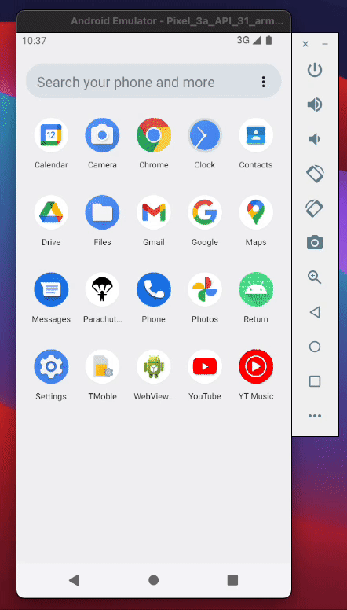

# ParachuteMan
## Inspiration
Inspired by Hangman and it looked fun to implement and it was a learning experience. 

## What it does
- There are two modes
    - Regular 
    - Time Attack Mode (Regular mode with a time limit)
- You will be given questions and you will have to choose the correct letters for the answers
- You will have 8 chances to save the parachute man (getting a letter wrong) 
 
## How we built it
- We used Java as our base programming language with Android Studio

## Challenges we ran into
- Sketching the parachute man
- Implementing the keys and keyboard size
- Implementing popup window for the situation when the player wins or loses
- Laying out the views
- Implementing a countdown timer for time attack

## Accomplishments that we're proud of
- We created a functional game without any expectations and prior experience

## What we learned
- How to collaborate through zoom with a team member(s) to design and build an app together
- Sketching app ideas in Miro
- Different classes using Java and Android 
- How to navigate through different screens and implementing the challenges listed above
- Creating views using xml
- We learned how to turn characters in a textview into dashes

## What's next for Parachute Man
- Updating the visuals
- Introducing a storyline
- Game mode based on different categories of questions
- Use different software architectures 
- More questions and answers
- Create a server to get question and answer instead of using an array
- Publish it in the playstore

## DEMO

